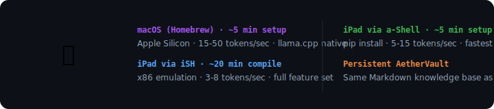

<div align="center">

# 🍎 A E T H E R — A P P L E
### *Local AI for macOS & iPad.*

[](VERSIONS.md)
[](LICENSE)

**[📲 Download](https://github.com/earnerbaymalay/aether-apple/releases)** · **[🌐 Sideload Hub](https://earnerbaymalay.github.io/sideload/)** · **[📖 Usage Guide](USAGE.md)** · **[🔧 Troubleshooting](TROUBLESHOOTING.md)**

</div>

---



## What is Aether Apple?

**Aether for macOS and iPad via three installation paths:** Homebrew on Mac (~5 min), iSH on iPad (~20 min compile), a-Shell on iPad (~5 min). Same local-first AI, same AetherVault, same CalVer version as Android.

---

## Quick Start

### Mac (Homebrew)

```bash
git clone https://github.com/earnerbaymalay/aether-apple.git
cd aether-apple
./install-apple.sh   # ~5 minutes
```

### iPad via iSH

1. Install [iSH Shell](https://apps.apple.com/app/ish-shell/id1436902243)
2. iPad Settings → iSH → set memory to 1024MB+
3. Inside iSH:
```bash
apk add git
git clone https://github.com/earnerbaymalay/aether-apple.git
cd aether-apple && ./install-apple.sh   # ~20 min compile
```

### iPad via a-Shell

1. Install [a-Shell](https://apps.apple.com/app/a-shell/id1473805438)
2. Inside a-Shell:
```bash
git clone https://github.com/earnerbaymalay/aether-apple.git
cd aether-apple && ./install-apple.sh
pip3 install llama-cpp-python
```

---

## Platform Comparison

| Feature | Mac (Full) | iPad iSH (Medium) | iPad a-Shell (Lite) |
|---------|------------|-------------------|---------------------|
| Engine | llama.cpp (Homebrew) | llama.cpp (from source) | Python + llama-cpp-python |
| Speed | 15-50 t/s (Apple Silicon) | 3-8 t/s (x86 emulation) | 5-15 t/s |
| Setup | ~5 min | ~20 min | ~5 min |
| Tools | 6 | 5 (no battery) | 5 (no battery) |
| AetherVault | ✅ | ✅ | ✅ |

---

## Related Projects

<div align="center">

| Project | Platform | Description | Link |
|---------|----------|-------------|------|
| 🌌 **Aether** | 📱 Android (Termux) | Local-first AI workstation | [Source →](https://github.com/earnerbaymalay/aether) |
| 🖥️ **Aether Desktop** | 🖥️ macOS / Win / Linux | Tauri desktop app | [Source →](https://github.com/earnerbaymalay/aether-desktop) |
| 📲 **Sideload Hub** | 🌐 Web / PWA | Central app distribution | [Open Hub →](https://earnerbaymalay.github.io/sideload/) |

</div>

---

## Documentation

- **[📖 Usage Guide](USAGE.md)** — Installation paths, operational modes, toolbox, AetherVault.
- **[🔧 Troubleshooting](TROUBLESHOOTING.md)** — Build failures, iSH compilation, memory issues.

---

[MIT License](LICENSE)
